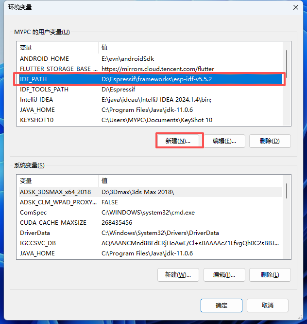
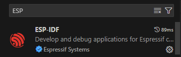
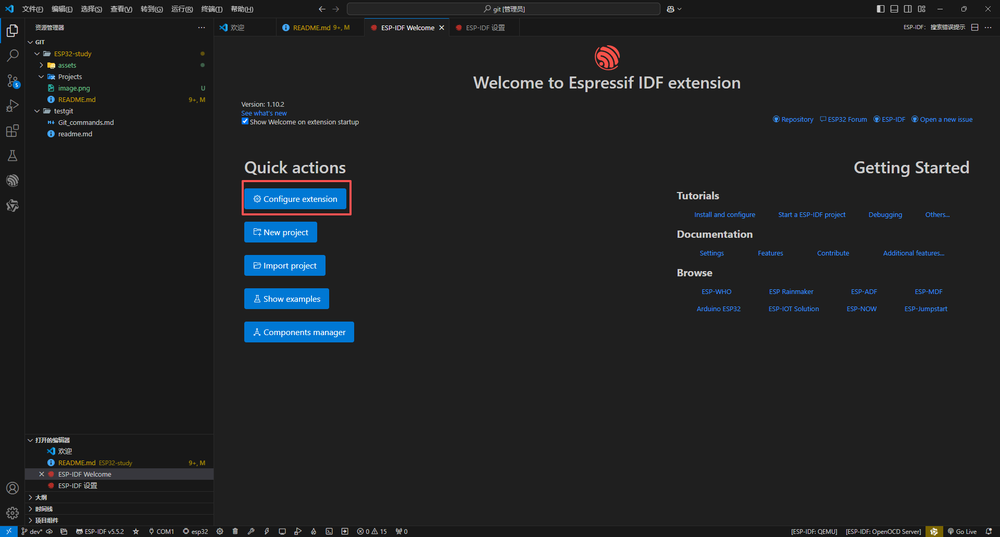
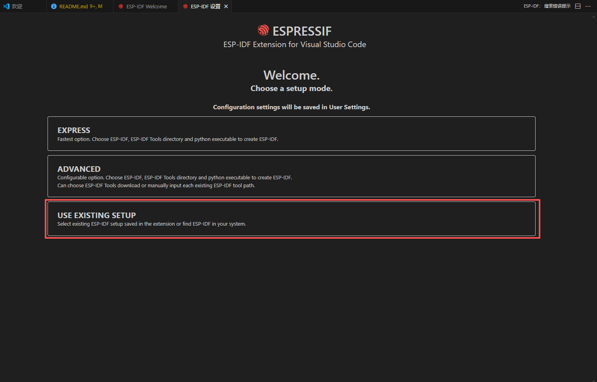
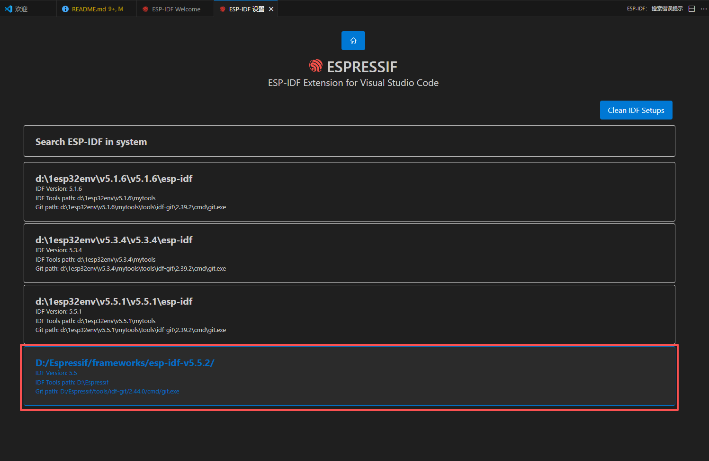

# ESP32-study

## 简介
记录ESP32学习过程 | 包括环境搭建、基础外设、网络、蓝牙等案例

## 学习路径 
- ESP32快速入门开发秘籍（IDF版)：  
  https://www.bilibili.com/video/BV1EPisBWEUX/

## 环境搭建

### IDF

下载路径：https://dl.espressif.cn/dl/esp-idf/

使用版本：ESP-IDF v5.5.2  

1. 安装完成后打开ESP-IDF 5.5 PowerShell或CMD  
   显示如图则代表安装成功
   

2. 设置环境变量
   右键 ` 此电脑 `, 点击 ` 属性 `, 选择 ` 高级系统设置` 中的 ` 环境变量 `

   

   点击 ` 用户变量 ` 的 ` 新建 `, 变量名设置为 ` IDF_PAHTH `, 变量值可点击 ` 浏览目录 `找到IDF安装路径里的 ` frameworks/esp-idf-v5.5.2 `

   

   确定

常用ESP-IDF命令
|功能|命令|说明|
|:---:|:---|:---|
|创建新工程|idf.py create-project --path &lt;project name&gt;|默认工程为esp32|
|设置目标芯片|idf.py set-target &lt;target&gt;|esp32s3、esp32p4|
|创建新的组件|idf.py create-component &lt;component name&gt;|创建外设驱动|
|编译工程|idf.py build|
|监控项目工程|idf.py monitor|退出监控 ` Ctrl + ] `|
|配置项目|idf.py menuconfig|项目配置|
|下载程序|idf.py -p COMx flash|x为端口号|
|清除编译文件|idf.py fullclean; idf.py clean|全部清除; 部分清除|

### VSCode环境搭建
1. 打开 ` VSCode `, 搜索插件 ` ESP-IDF `并安装
   

2. 进入到 ` ESP-IDE Welcome `， 点击 ` Configure extention `
   

3. 进入到 ` ESP-IDF 设置 `, 点击 ` USE EXISTING SETUP `后选择 ` 版本 `
   
   
